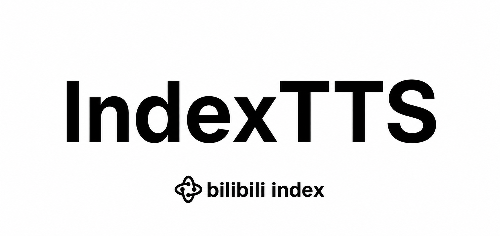

<div align="center">



# IndexTTS

**An Industrial-Level Controllable and Efficient Zero-Shot Text-to-Speech System**

[简体中文](docs/README_zh.md) | English

</div>

IndexTTS is a zero-shot text-to-speech system that clones a voice from a single
reference audio clip. The latest release, **IndexTTS-2.5**, supports Chinese,
English, Japanese, Spanish and Arabic, with fine-grained emotion control,
pronunciation control (Pinyin / CMU phonemes / Japanese Kana), and faster
inference than IndexTTS-2.

---

## 🗂️ Model Zoo

| Model | Demos | Paper | ModelScope | HuggingFace |
| :--- | :---: | :---: | :---: | :---: |
| **IndexTTS-2.5** | [](https://index-tts.github.io/index-tts2-5.github.io/) | [](https://arxiv.org/abs/2601.03888) | [](https://modelscope.cn/models/IndexTeam/IndexTTS-2.5) | [](https://huggingface.co/IndexTeam/IndexTTS-2.5) |
| **IndexTTS-2** | [](https://index-tts.github.io/index-tts2.github.io/) | [](https://arxiv.org/abs/2506.21619) | [](https://modelscope.cn/models/IndexTeam/IndexTTS-2) | [](https://huggingface.co/IndexTeam/IndexTTS-2) |
| **IndexTTS-1.5** | [](https://index-tts.github.io/) | [](https://arxiv.org/abs/2502.05512) | [](https://modelscope.cn/models/IndexTeam/IndexTTS-1.5) | [](https://huggingface.co/IndexTeam/IndexTTS-1.5) |
| **IndexTTS** | [](https://index-tts.github.io/) | [](https://arxiv.org/abs/2502.05512) | [](https://modelscope.cn/models/IndexTeam/Index-TTS) | [](https://huggingface.co/IndexTeam/Index-TTS) |

## 📣 News

- `2026/08/10` 🔥 We release **IndexTTS-2.5**
  - Now supports Chinese, English, Japanese, Spanish and Arabic, with faster inference than IndexTTS-2, while keeping the cross-lingual and timbre-emotion disentanglement capabilities.
  - Improved controllability of Chinese Pinyin, English CMU phonemes and Japanese Kana.
- `2025/09/08` 🔥 We release **IndexTTS-2**
  - The first autoregressive TTS model with precise synthesis duration control, supporting both controllable and uncontrollable modes. <i>This functionality is not yet enabled in this release.</i>
  - Highly expressive emotional speech synthesis, with emotion control through multiple input modalities.
- `2025/05/14` 🔥 We release **IndexTTS-1.5**, significantly improving the model's stability and its performance in English.
- `2025/03/25` 🔥 We release **IndexTTS-1.0** with model weights and inference code.
- `2025/02/12` 🎉 We submitted our paper to arXiv, and released our demos and test sets.

## 🎬 Demos

<div align="center">

**IndexTTS-2.5: The Future of Voice, Now Generating**

[](https://www.bilibili.com/video/BV1uvMk6ZEdK/)

**IndexTTS-2: The Future of Voice, Now Generating**

[](https://www.bilibili.com/video/BV136a9zqEk5)

</div>

## 🚀 Getting Started

### 1. Prerequisites

Make sure you have [git](https://git-scm.com/downloads) and
[git-lfs](https://git-lfs.com/) installed, with Git-LFS enabled for your
current user account:

```bash
git lfs install
```

Then download this repository:

```bash
git clone https://github.com/index-tts/index-tts.git && cd index-tts
git lfs pull  # download large repository files
```

### 2. Install Dependencies

We use [uv](https://docs.astral.sh/uv/getting-started/installation/) to manage
the project's dependency environment. It is **required** for a reliable
installation:

```bash
pip install -U uv  # or see the link above for other install methods
```

```bash
uv sync --all-extras
```

This automatically creates a `.venv` project directory and installs the correct
versions of Python and all required dependencies.

If the download is slow, use a local mirror, e.g. one of these mirrors in China:

```bash
uv sync --all-extras --default-index "https://mirrors.aliyun.com/pypi/simple"

uv sync --all-extras --default-index "https://mirrors.tuna.tsinghua.edu.cn/pypi/web/simple"
```

> [!TIP]
> **Available Extra Features:**
>
> - `--all-extras`: Automatically adds *every* extra feature listed below. You can
>   remove this flag if you want to customize your installation choices.
> - `--extra webui`: Adds WebUI support (recommended).
> - `--extra deepspeed`: Adds DeepSpeed support (may speed up inference on some
>   systems).

> [!IMPORTANT]
> **Windows:** DeepSpeed may be difficult to install. You can skip it by removing
> the `--all-extras` flag and adding the other feature flags manually.
>
> **Linux/Windows:** If you see a CUDA error during installation, make sure
> NVIDIA's [CUDA Toolkit](https://developer.nvidia.com/cuda-toolkit) version
> **12.8** (or newer) is installed on your system.

### 3. Download Models

Download the required models via [uv tool](https://docs.astral.sh/uv/guides/tools/#installing-tools):

Via `huggingface-cli`:

```bash
uv tool install "huggingface-hub[cli,hf_xet]"

# IndexTTS-2.5
hf download IndexTeam/IndexTTS-2.5 --local-dir=checkpoints

# IndexTTS-2
hf download IndexTeam/IndexTTS-2 --local-dir=checkpoints_2
```

Or via `modelscope`:

```bash
uv tool install "modelscope"

# IndexTTS-2.5
modelscope download --model IndexTeam/IndexTTS-2.5 --local_dir checkpoints

# IndexTTS-2
modelscope download --model IndexTeam/IndexTTS-2 --local_dir checkpoints_2
```

> [!IMPORTANT]
> If the commands above aren't available, carefully read the `uv tool` output —
> it will tell you how to add the tools to your system's PATH.

> [!NOTE]
> Some small models are downloaded automatically on first run. If your network
> has slow access to HuggingFace, set a mirror before running the code:
>
> ```bash
> export HF_ENDPOINT="https://hf-mirror.com"
> ```

### 4. Check GPU Acceleration

To diagnose your environment and see which GPUs are detected, use the included
utility:

```bash
uv run tools/gpu_check.py
```

## 💻 Usage

### 🌐 Web Demo

```bash
# IndexTTS-2.5 (default)
uv run webui.py --version 2.5 --model_dir ./checkpoints

# IndexTTS-2
uv run webui.py --version 2 --model_dir ./checkpoints_2
```

Open your browser and visit `http://127.0.0.1:7860` to see the demo.

You can adjust the settings to enable BF16 (IndexTTS-2.5) / FP16 (IndexTTS-2)
inference (lower VRAM usage), DeepSpeed acceleration, compiled CUDA kernels for
speed, etc. All available options can be seen via:

```bash
uv run webui.py -h
```

> [!IMPORTANT]
> **FP16/BF16** (half-precision) inference is faster and uses less VRAM, with
> very small quality loss.
>
> **DeepSpeed** *may* speed up inference on some systems, but it could also make
> it slower — it depends on your hardware, drivers and OS. Try both ways.
>
> All `uv` commands **automatically activate** the correct per-project virtual
> environment. Do *not* manually activate any environment before running `uv`
> commands, as that can cause dependency conflicts.

### 🚀 Serving with vLLM

For production deployment, see the [vLLM recipe for IndexTTS](https://github.com/vllm-project/recipes/pull/772).

### 📝 Python API

To run scripts, use `uv run <file.py>` so the code runs inside the `uv`
environment. You may also need to add the current directory to `PYTHONPATH`:

```bash
# IndexTTS2
PYTHONPATH="$PYTHONPATH:." uv run indextts/infer_v2.py

# IndexTTS2.5
PYTHONPATH="$PYTHONPATH:." uv run indextts/infer_v2_5.py \
  --cfg_path checkpoints/config.yaml \
  --model_dir checkpoints \
  --text "Hello world" \
  --lang EN
```

#### 0. Initialize IndexTTS

```python
# IndexTTS2
from indextts.infer_v2 import IndexTTS2
tts = IndexTTS2(cfg_path="checkpoints_2/config.yaml", model_dir="checkpoints_2", use_fp16=False, use_cuda_kernel=False, use_deepspeed=False)

# IndexTTS2.5
from indextts.infer_v2_5 import IndexTTS2
tts = IndexTTS2(cfg_path="checkpoints/config.yaml", model_dir="checkpoints", use_bf16=True)
```

#### 1. Voice cloning with a single reference audio

```python
text = "Translate for me, what is a surprise!"

# IndexTTS2
tts.infer(spk_audio_prompt='examples/voice_01.wav', text=text, output_path="gen.wav", verbose=True)

# IndexTTS2.5 (multilingual, with language selection)
tts.infer(spk_audio_prompt='examples/voice_01.wav', text=text, lang="EN", output_path="gen.wav", verbose=True)
```

#### 2. Emotion control with a separate emotional reference audio

```python
text = "酒楼丧尽天良，开始借机竞拍房间，哎，一群蠢货。"

# IndexTTS2
tts.infer(spk_audio_prompt='examples/voice_07.wav', text=text, output_path="gen.wav", emo_audio_prompt="examples/emo_sad.wav", verbose=True)

# IndexTTS2.5
tts.infer(spk_audio_prompt='examples/voice_07.wav', text=text, lang="ZH", output_path="gen.wav", emo_audio_prompt="examples/emo_sad.wav", verbose=True)
```

#### 3. Adjust emotion intensity with `emo_alpha`

When an emotional reference audio is specified, `emo_alpha` adjusts how much it
affects the output. Valid range: `0.0 - 1.0`, default: `1.0` (100%).

```python
text = "酒楼丧尽天良，开始借机竞拍房间，哎，一群蠢货。"

# IndexTTS2
tts.infer(spk_audio_prompt='examples/voice_07.wav', text=text, output_path="gen.wav", emo_audio_prompt="examples/emo_sad.wav", emo_alpha=0.9, verbose=True)

# IndexTTS2.5
tts.infer(spk_audio_prompt='examples/voice_07.wav', text=text, output_path="gen.wav", lang="ZH", emo_audio_prompt="examples/emo_sad.wav", emo_alpha=0.9, verbose=True)
```

#### 4. Emotion control with an emotion vector

You can omit the emotional reference audio and instead provide an 8-float list
specifying the intensity of each emotion, in the order
`[happy, angry, sad, afraid, disgusted, melancholic, surprised, calm]`.
Use `use_random` to introduce stochasticity during inference (default: `False`).

> [!NOTE]
> Enabling random sampling reduces the voice cloning fidelity.

```python
text = "对不起嘛！我的记性真的不太好，但是和你在一起的事情，我都会努力记住的~"

# IndexTTS2
tts.infer(spk_audio_prompt='examples/09.wav', text=text, output_path="gen.wav", emo_vector=[0, 0, 0.8, 0, 0, 0, 0, 0], use_random=False, verbose=True)

# IndexTTS2.5
tts.infer(spk_audio_prompt='examples/09.wav', text=text, lang="ZH", output_path="gen.wav", emo_vector=[0, 0, 0.8, 0, 0, 0, 0, 0], use_random=False, verbose=True)
```

#### 5. Emotion control from the text itself (`use_emo_text`)

Enable `use_emo_text` to automatically convert your `text` script into emotion
vectors. An `emo_alpha` around 0.6 (or lower) is recommended for more natural
speech. Randomness can be introduced with `use_random` (default: `False`).

```python
text = "快躲起来！是他要来了！他要来抓我们了！"

# IndexTTS2
tts.infer(spk_audio_prompt='examples/voice_12.wav', text=text, output_path="gen.wav", emo_alpha=0.6, use_emo_text=True, use_random=False, verbose=True)

# IndexTTS2.5
tts.infer(spk_audio_prompt='examples/voice_12.wav', text=text, lang="ZH", output_path="gen.wav", emo_alpha=0.6, use_emo_text=True, use_random=False, verbose=True)
```

#### 6. Emotion control with an explicit emotion description (`emo_text`)

Provide a specific text emotion description via `emo_text`, which is converted
into emotion vectors — giving you separate control of the text script and the
emotion description:

```python
text = "快躲起来！是他要来了！他要来抓我们了！"
emo_text = "你吓死我了！你是鬼吗？"

# IndexTTS2
tts.infer(spk_audio_prompt='examples/voice_12.wav', text=text, output_path="gen.wav", emo_alpha=0.6, use_emo_text=True, emo_text=emo_text, use_random=False, verbose=True)

# IndexTTS2.5
tts.infer(spk_audio_prompt='examples/voice_12.wav', text=text, lang="ZH", output_path="gen.wav", emo_alpha=0.6, use_emo_text=True, emo_text=emo_text, use_random=False, verbose=True)
```

#### 7. Speaking speed control (`duration_factor`)

A value greater than `1.0` slows down the speech, a value less than `1.0`
speeds it up. Default: `1.0` (normal speed). Valid range: `0.5 - 2.0`.

```python
text = "大家好，欢迎来到IndexTTS的语速控制演示。"

# IndexTTS2.5
# Slow down (1.2x duration)
tts.infer(spk_audio_prompt='examples/voice_01.wav', text=text, lang="ZH", output_path="gen_slow.wav", duration_factor=1.2, verbose=True)

# Speed up (0.8x duration)
tts.infer(spk_audio_prompt='examples/voice_01.wav', text=text, lang="ZH", output_path="gen_fast.wav", duration_factor=0.8, verbose=True)
```

### 🗣️ Pronunciation Control

**IndexTTS2.5 — Pinyin / CMU phonemes / Japanese Kana:**

IndexTTS2.5 supports these character replacements with better
instruction-following capability. For the full list of valid entries, see
`checkpoints/pinyin.vocab` for Pinyin and the
[CMU dictionary](https://svn.code.sf.net/p/cmusphinx/code/trunk/cmudict/cmudict-0.7b)
for English phonemes.

```
他在银<行|XING2>里<行|HANG2>走了半天，发现这笔业务办不<行|HANG2>。

He had a <minute|M IH1 . N AH0 T> to examine the <minute|M AY0 . N UW1 T> details of the contract.

彼は料理が<上手|じょうず>だが、囲碁では<上手|うわて>に負けた。
```

**IndexTTS2 — Pinyin:**

IndexTTS2 supports mixed modeling of Chinese characters and Pinyin. To activate
Pinyin control, provide text with specific Pinyin annotations. Note that Pinyin
control does not work for every possible consonant–vowel combination; only
valid Chinese Pinyin cases are supported (see `checkpoints/pinyin.vocab`).

```
之前你做DE5很好，所以这一次也DEI3做DE2很好才XING2，如果这次目标完成得不错的话，我们就直接打DI1去银行取钱。
```

### 🕰️ IndexTTS-1.5 (Legacy)

You can also use the previous IndexTTS1 model by importing a different module:

```python
from indextts.infer import IndexTTS
tts = IndexTTS(model_dir="checkpoints", cfg_path="checkpoints/config.yaml")
voice = "examples/voice_07.wav"
text = "大家好，我现在正在bilibili 体验 ai 科技，说实话，来之前我绝对想不到！AI技术已经发展到这样匪夷所思的地步了！比如说，现在正在说话的其实是B站为我现场复刻的数字分身，简直就是平行宇宙的另一个我了。如果大家也想体验更多深入的AIGC功能，可以访问 bilibili studio，相信我，你们也会吃惊的。"
tts.infer(voice, text, 'gen.wav')
```

For more details, see [README_INDEXTTS_1_5](archive/README_INDEXTTS_1_5.md),
or visit the IndexTTS1 repository at [index-tts:v1.5.0](https://github.com/index-tts/index-tts/tree/v1.5.0).

## 📊 Evaluation

Table 1: Zero-shot TTS evaluation results on CV3-Eval test set (Arabic uses an in-house test set). WER (%) ↓ and Speaker Similarity (SS) ↑ are reported. †Results cited from the original paper.

| Model | Params | test-zh<br>WER (%) ↓ | test-zh<br>SS (%) ↑ | test-en<br>WER (%) ↓ | test-en<br>SS (%) ↑ | test-es<br>WER (%) ↓ | test-es<br>SS (%) ↑ | test-ja<br>WER (%) ↓ | test-ja<br>SS (%) ↑ | test-ar<br>WER (%) ↓ | test-ar<br>SS (%) ↑ | Average<br>WER (%) ↓ | Average<br>SS (%) ↑ |
| :--- | :---: | :---: | :---: | :---: | :---: | :---: | :---: | :---: | :---: | :---: | :---: | :---: | :---: | :---: |
| VoxCPM2 | 2B | 3.88 | 74.99 | 5.13 | 71.57 | 5.49 | 74.67 | 6.69 | 72.90 | 14.94 | 65.99 | 7.22 | 72.02 |
| OmniVoice | 0.8B | 3.41 | 72.99 | 3.62 | 70.13 | 3.52 | 74.14 | 5.38 | 70.49 | 17.88 | 64.22 | 6.76 | 70.39 |
| Moss-TTS 1.5 | 8B | 4.02 | 72.68 | 4.45 | 67.46 | 3.83 | 71.75 | 10.97 | 68.71 | 23.71 | 62.21 | 9.40 | 68.56 |
| CosyVoice3-0.5B | 0.5B | 3.84 | 80.01 | 4.88 | 74.16 | 4.04 | 78.85 | - | 76.36 | - | - | - | - |
| CosyVoice3-1.5B | 1.5B | 3.91† | - | 4.99† | - | 4.47† | - | 7.57† | - | - | - | - | - |
| FireRedTTS-2 | 1.5B | 8.22 | 68.10 | 14.92 | 56.93 | - | - | - | - | - | - | - | - |
| Fish Audio S2 Pro | 4B | 3.62 | 67.79 | 3.83 | 61.66 | 2.93 | 67.44 | 5.15 | 66.15 | 14.15 | 59.43 | 5.94 | 64.49 |
| Qwen3-TTS | 1.7B | 3.27 | 73.02 | 5.06 | 67.17 | 2.87 | 73.17 | 5.89 | 70.18 | - | - | - | - |
| **IndexTTS2.5** | 0.8B | 4.36 | 77.10 | 5.12 | 68.06 | 3.75 | 76.39 | 5.66 | 74.62 | 14.88 | 69.74 | 6.75 | 73.18 |
| **IndexTTS2.5-RL** | 0.8B | 3.93 | 77.92 | 3.89 | 67.79 | 3.33 | 76.68 | 5.30 | 75.41 | 13.58 | 70.36 | 6.00 | 73.63 |

Table 2: Cross-lingual TTS evaluation on CV3-Eval test set (Chinese prompt → target language, Arabic uses an in-house test set). WER (%) ↓ and Speaker Similarity (SS) ↑ are reported.

| Model | Params | zh→en<br>WER (%) ↓ | zh→en<br>SS (%) ↑ | zh→es<br>WER (%) ↓ | zh→es<br>SS (%) ↑ | zh→ja<br>WER (%) ↓ | zh→ja<br>SS (%) ↑ | zh→ar<br>WER (%) ↓ | zh→ar<br>SS (%) ↑ | Average<br>WER (%) ↓ | Average<br>SS (%) ↑ |
| :--- | :---: | :---: | :---: | :---: | :---: | :---: | :---: | :---: | :---: | :---: | :---: |
| VoxCPM2 | 2B | 4.48 | 64.25 | 16.38 | 64.89 | 11.84 | 71.54 | 11.09 | 67.62 | 10.95 | 67.08 |
| OmniVoice | 0.8B | 3.74 | 64.91 | 5.84 | 62.08 | 9.09 | 69.06 | 19.80 | 65.27 | 9.62 | 65.33 |
| Moss-TTS 1.5 | 8B | 6.13 | 59.23 | 4.32 | 56.63 | 11.52 | 65.54 | 17.03 | 62.93 | 9.75 | 61.08 |
| CosyVoice3-0.5B | 0.5B | 3.23 | 62.79 | 4.58 | 64.04 | - | - | - | - | - | - |
| CosyVoice3-1.5B | 1.5B | 4.32 | - | - | - | 13.70 | - | - | - | - | - |
| FireRedTTS-2 | 1.5B | 9.34 | 53.19 | 12.25 | 58.31 | 19.05 | 64.12 | - | - | - | - |
| Fish Audio S2 Pro | 4B | 4.14 | 55.89 | 4.46 | 55.57 | 10.48 | 61.74 | 14.49 | 59.80 | 8.39 | 58.25 |
| Qwen3-TTS | 1.7B | 5.74 | 63.04 | 5.15 | 68.02 | 36.09 | 65.71 | - | - | - | - |
| **IndexTTS2.5** | 0.8B | 3.62 | 63.83 | 5.17 | 65.48 | 6.57 | 74.16 | 9.51 | 71.02 | 6.22 | 68.62 |
| **IndexTTS2.5-RL** | 0.8B | 3.55 | 67.47 | 4.86 | 64.47 | 6.38 | 75.82 | 9.89 | 73.05 | 6.17 | 70.20 |

## 🤝 Community & Contact

- **QQ Groups:** 663272642 (No.4), 1013410623 (No.5)
- **Discord:** https://discord.gg/uT32E7KDmy
- **Email:** indexspeech@bilibili.com

You are welcome to join our community! 🌏 欢迎大家来交流讨论！

> [!CAUTION]
> Thank you for your support of the bilibili IndexTTS project!
> Please note that the **only official channel** maintained by the core team is: [https://github.com/index-tts/index-tts](https://github.com/index-tts/index-tts).
> ***Any other websites or services are not official***, and we cannot guarantee their security, accuracy, or timeliness.
> For the latest updates, please always refer to this official repository.

For commercial usage and cooperation, please contact <u>indexspeech@bilibili.com</u>.

## 📚 Citation

🌟 If you find our work helpful, please leave us a star and cite our papers.

IndexTTS2.5:

```bibtex
@misc{li2026indextts25technicalreport,
      title={IndexTTS 2.5 Technical Report},
      author={Yunpei Li and Xun Zhou and Jinchao Wang and Lu Wang and Yong Wu and Siyi Zhou and Yiquan Zhou and Yining Wang and Yaogen Yang and Zhetao Hu and Shiyao Duan and Jiacheng Xu and Bin Xia and Jingchen Shu},
      year={2026},
      eprint={2601.03888},
      archivePrefix={arXiv},
      primaryClass={cs.SD},
      url={https://arxiv.org/abs/2601.03888},
}
```

IndexTTS2:

```bibtex
@article{zhou2025indextts2,
  title={IndexTTS2: A Breakthrough in Emotionally Expressive and Duration-Controlled Auto-Regressive Zero-Shot Text-to-Speech},
  author={Siyi Zhou and Yiquan Zhou and Yi He and Xun Zhou and Jinchao Wang and Wei Deng and Jingchen Shu},
  journal={arXiv preprint arXiv:2506.21619},
  year={2025}
}
```

IndexTTS:

```bibtex
@article{deng2025indextts,
  title={IndexTTS: An Industrial-Level Controllable and Efficient Zero-Shot Text-To-Speech System},
  author={Wei Deng and Siyi Zhou and Jingchen Shu and Jinchao Wang and Lu Wang},
  journal={arXiv preprint arXiv:2502.05512},
  year={2025},
  doi={10.48550/arXiv.2502.05512},
  url={https://arxiv.org/abs/2502.05512}
}
```

## 🙏 Acknowledgements

1. [tortoise-tts](https://github.com/neonbjb/tortoise-tts)
2. [XTTSv2](https://github.com/coqui-ai/TTS)
3. [BigVGAN](https://github.com/NVIDIA/BigVGAN)
4. [wenet](https://github.com/wenet-e2e/wenet/tree/main)
5. [icefall](https://github.com/k2-fsa/icefall)
6. [maskgct](https://github.com/open-mmlab/Amphion/tree/main/models/tts/maskgct)
7. [seed-vc](https://github.com/Plachtaa/seed-vc)

## 📄 License

This project is released under the [bilibili Model Use License Agreement](LICENSE).
Please also read the [DISCLAIMER](DISCLAIMER) before use.
